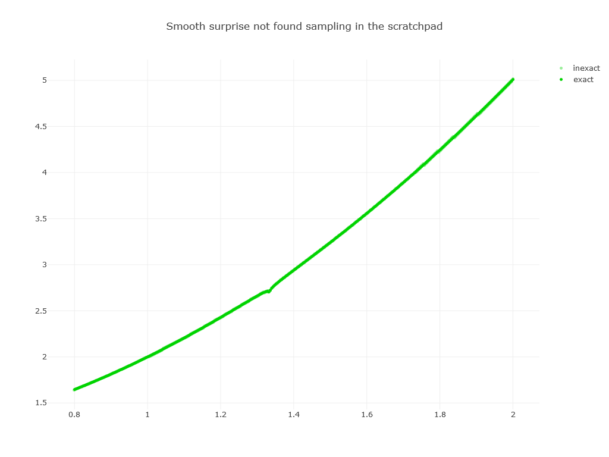
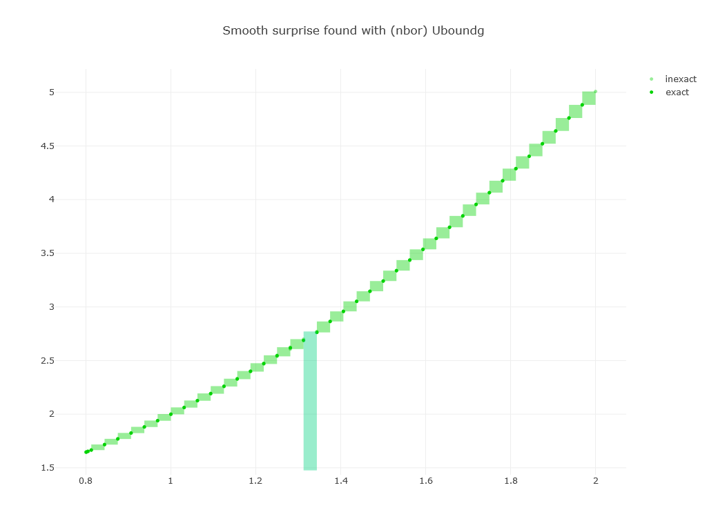
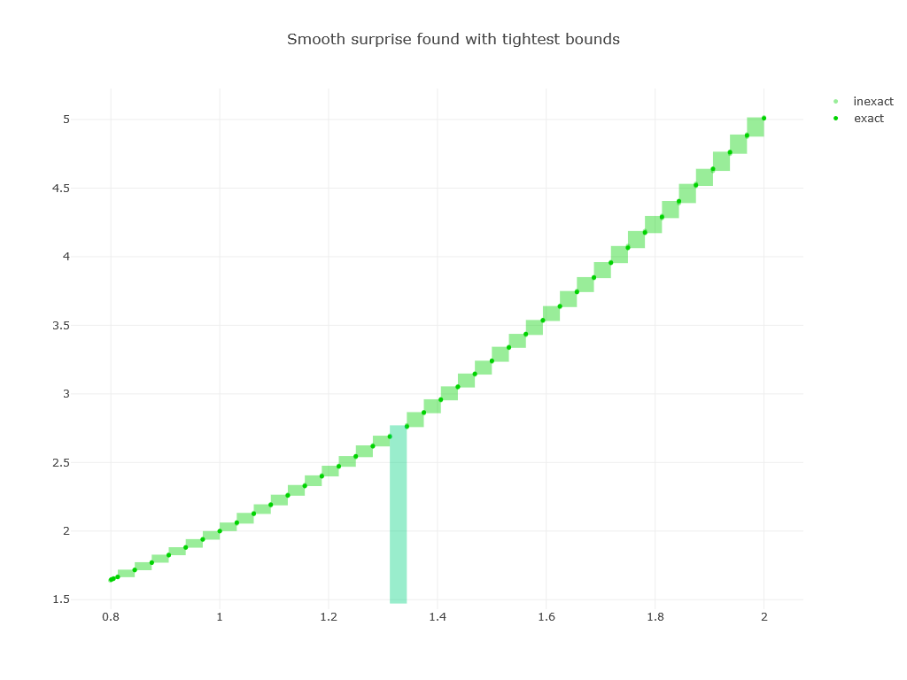
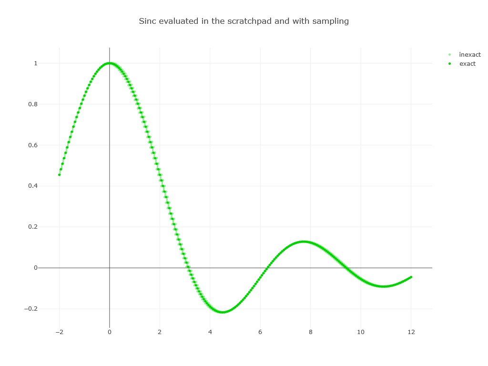
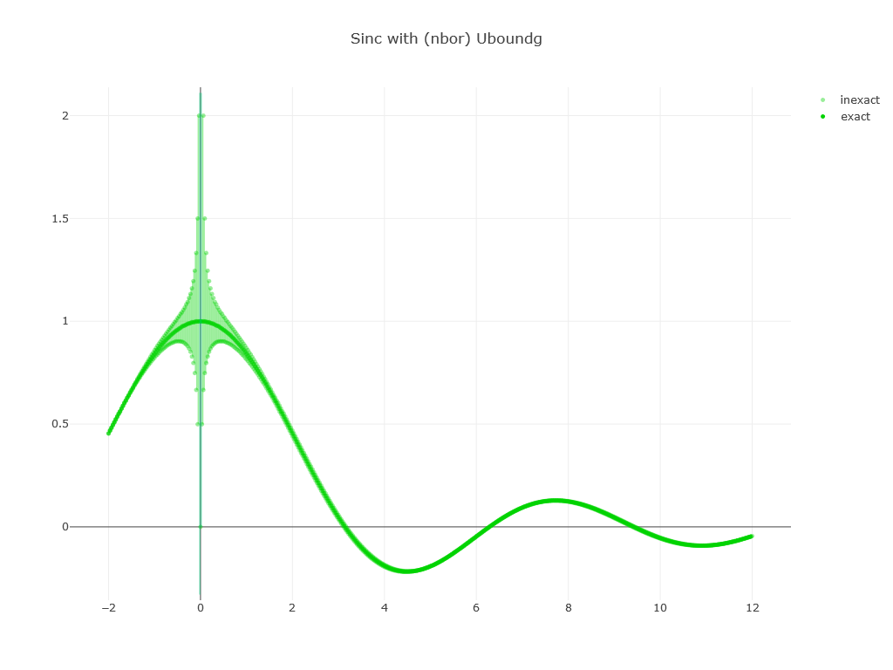
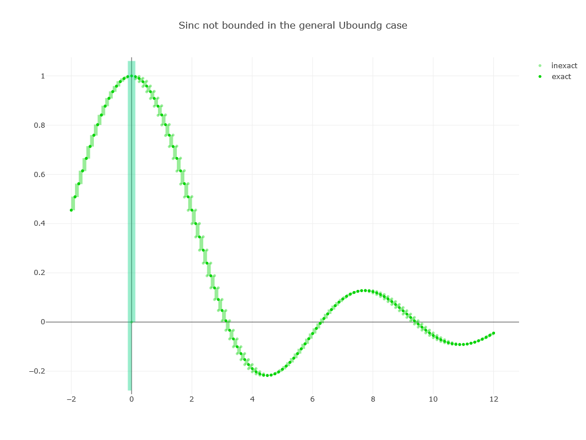
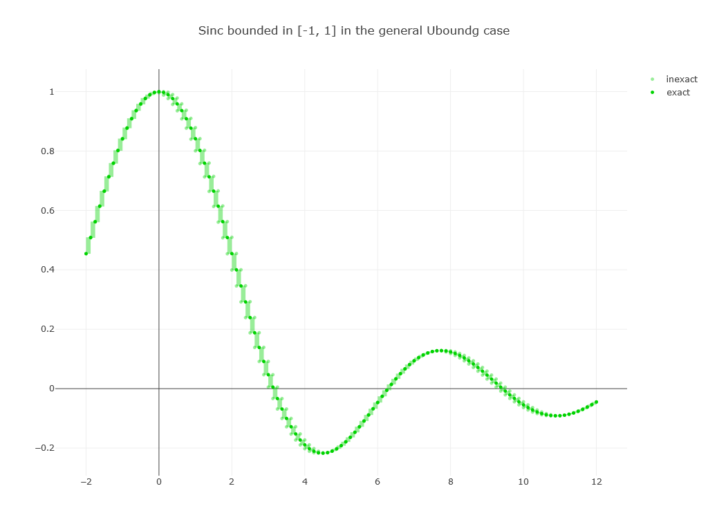

# fsunum

This is a port of the **unum type 1** to F# / .NET using floats as scratchpad.

## Table of contents
- [About](#about)
- [Structure](#structure)
- [Notes on tests](#notes-on-tests)
- [Getting Started](#getting-started)
- [Licenses and sources](#licenses-and-sources)

## About 
This follows the work from [J. L. Gustafson](http://johngustafson.net/) from his Mathematica prototype shown in his book [The End of Error](https://www.amazon.com/gp/product/1482239868?keywords=the%20end%20of%20error%20unum%20computing&qid=1456088488&ref_=sr_1_1&sr=8-1).

**Unums** are number systems defining **consecutive exact numbers** (IEEE float like) and **the interval between them** (using one bit, the **ubit**) so they **map the real line** at a given precision. As fields, they provide an algebraic way to do calculus. Unlike floats and classical methods, they don't rely on sampling and rounding to deliver **proven results** mostly at ULP level (Unit in the Last Place) or fall back on unums intervals. This behavior restores associativity and enable better parallel computations.

The book and the Mathematica prototype were a manifesto to build a new hardware float architecture. The **fsunum** solution attempts a pragmactic **unum software architecture** focused on **leveraging existing hardware** (SIMD/primitive float).

fsunum shifts unums handling when a hardware implementation seems impractical or when the prototype can benefit from more abstraction or a different platform:

| prototype | fsunum |
| :------- | :-------- |
| based on an integer based, arbitrary precision scratchpad, with variable time and data spends | leveraging fast multiple-floats libraries with a known beforehand trade-off between precision, space and speed |
| unum interval arithmetic limits information loss but can be too coarse or diverge | minimum information loss algorithm for general functions is provided (extension of the prototype polynomial one) | 
| Mathematica is a niche environment | .NET is a mainstream dev. platform and executes anywhere |
| unums have variable sizes and their manipulation is slow when changing layers | embedded in fixed size integers and possibly lazily evaluated |
| {e,f} global unum environment, functions check for valid arguments in every context, etc. | various optimizations: environment is independent from functions, validation occurs once per external call, etc. |

Despite being scrathpad precision bounded, the fsunum libraries pass the main tests from the book (but one needs the scratchpad from the **advanced** library though).

## Structure

The fsunum **basic** libraries has two layers:
1. `basic\scratchpad`: the scratchpad defined as an interface type in `ifl.fs` file along with two actual implementations: the primitivz 64 bits F# `float` type and the double-float `dfloat` type from the `df.fs` file. The `dfloat` type has the same dynamic range as `float` but up to 106 bits of precision.
2. `basic\unum` the unum/ubound level, mainly translating the Mathematica code in the `unum64.fs` file. In `uboundenv64.fs` the uboundenv types enhance usability, allowing lazy evaluation, symbolic computation (expression evaluation) and functions as expression. A `plotly.fs` file allows to make charts from unum functions using the [plot.ly](https://plot.ly/) library. This file contains a algorithm preventing information loss from general functions over domains.

Each layers has their source code in a `src` folder along with a `tests` folder for integration tests. The tests in `ununm\tests` folder are good entry point on how using fsunum unums.

A global solution file, at the root of the library, `basic.sln`, allows to build the libraries and run all tests. During the generation, the files `basiscratchpad.dll` and `basicunum.dll` are copied into a `bin` directory at library root for your own projects.

An example project `chartexamples` is there to show you how to make your own projects. If you need to access the code from fsunum while coding, it maybe better to temporarily add your project to the `basic.sln` solution.

Note there is an **advanced** libraries set which is not published at this time. The structure is similar to the basic ones and they feature:
* a quad-floats type scratchpad (`qfloat`) with 212 bits of precision,
* a unum128 version of unum/ubound based on the `uint128` type.

## Notes on tests

The tests on scratchpad types are the ones from the QD library from [David Bailey/LBNL](#licenses-notes-and-sources). They verify the accuracy obtained on classical math functions.

The tests on unums are from the Gustafson book. Here are some descriptions if you're not in front of the book.

* Bailey’s numerical nightmare: an integer coefficients 2x2 equations solving that fails on float (64 bits) but succeeds with unums {3,5} (single float (32 bits) like precision) with `dfloat` scratchpad. The different tests shows how to use:
  * `UboundenvDM` type: unums with data movement tallying,
  * `Uboundenv` type: unums evaluated at each computation,
  * `Uboundenvg` type: unums staying in the scratchpad and evaluated as unum at the end of computations (much faster).

* Jean-Michel Muller H function: A clever composite function that fails on every float but succeeds with unums whatever the precision (environement {0,0} works). It illustrates the use of the "`.=`" operator that returns true if there is a common interval for the two unums/ubounds compared.

* The wrath of Kahan: a particular sequence that becomes unstable when the error builds up in the scratchpad. Unums on `dfloat` pass the test over the 12 iterations as in the book. Eventually it fails at the 29th iterations and two times that for `qfloat`. But as written, we can track the relative width of unums and know when more precision is required so we can take action.

* The quadratic formula: a case where one solution has digits cancellation from a subtract operation. The `float32` solution has only 5 digits of precision whereas the {3,5} unum has 7 and a bounded result.

* The smooth surprise: a general function that present a minus infinity pole on the given domain. With float, the pole is missed whatever the sampling. Unums gets the pole whatever the environment.

* Note that the Rump's royal pain test is not present in the basic fsunum tests: The `qfloat` scratchpad from the advanced library is required to pass this test.

## Getting started
Build the libraries using the `basic.sln` solution file. You can now link them into your project or use the fsi (FSharp Interactive repl window). At the time of writing, the F# Interactive window from VS2017 is broken for fsunum, so proceed as follows:
1) open a command promt (cmd.exe) then invoke a fsi session like so:
```
Microsoft Windows [version 10.0.17134.471]
(c) 2018 Microsoft Corporation. Tous droits réservés.

C:\Users\your_account>dotnet "C:\Program Files\dotnet\sdk\2.1.502\FSharp\fsi.exe"

Microsoft (R) F# Interactive version 10.2.3 for F# 4.5
Copyright (c) Microsoft Corporation. Tous droits réservés.

Pour obtenir de l'aide, tapez #help;;

>
```
3) now getting the fsunum libraries available:
* add the path to the fsunum libraries. Note that you will have to replace the **your_account** in the following path by your **actual account name**,
* load the libraries,
* open the fsunum namespace,
* open the required modules for the desired operations.
```
> #I @"C:\Users\your_account\source\repos\fsunum\bin\Debug\netstandard2.0";;

--> Ajout de 'C:\Users\your_account\source\repos\fsunum\bin\Debug\netstandard2.0' au chemin d'accès Include de la bibliothèque

> #r "basicscratchpad.dll";;

--> Référencement de 'C:\Users\your_account\source\repos\fsunum\bin\Debug\netstandard2.0\basicscratchpad.dll' (le fichier est peut-être verrouillé par le processus F# Interactive)

> #r "basicunum.dll";;

--> Référencement de 'C:\Users\your_account\source\repos\fsunum\bin\Debug\netstandard2.0\basicunum.dll' (le fichier est peut-être verrouillé par le processus F# Interactive)

> open fsunum;;
> open df;;
```
4) let's do some math on the `dfloat` scratchpad:
```
> open unum64;; 
> let one = dfloat.One;;
val one : dfloat = 1
> let two = one + one;;
val two : dfloat = 2
> let sqrt2 = dfloat.sqrt two;;
val sqrt2 : dfloat = 1.41421356237309504880168872421
```
note the value of square root of 2 is workout to 31 digits.
5) let's open unum64 module and do some math. We are using a {4,6} environment with a `float` scratchpad with unums lazily evaluated:
```
> let thirty = ENV46gf.IFrom.from 30.;;
val thirty : Uboundg<float> = 30

> let cos30deg = Uboundg<float>.cos thirty;;
val cos30deg : Uboundg<float> = 0.866025403784

> cos30deg.ViewUnum;;
val it : string =
  "(0.8660254037844197227968834340572357177734375, 0.86602540378453340963460505008697509765625)"
```
note that the computed value of square root of 3 over 2, is internally stored as one exact number with the ubit set, expressing the interval between the 2 exact unums, shown in the last line.
6) for anything more sophisticated I strongly recommend to make projects. The `chartexamples` project gives you some examples of functions charting. If you run it the result will be the following charts in your browser, which is also the occasion to show unums behaviors and library features:
* Note that in the code, we define math functions as a F# function returning an expression tree like so:
```
(fun U -> fexp.From 1. + fexp.Sqr( fexp.Expr U ) + fexp.Log( fexp.Abs(fexp.From 1. + fexp.From 3. * (fexp.From 1. - fexp.Expr U)) ) / fexp.From 80. )
```
The `U` expression is the function variable and the right part of this `->` statement is the function expression. This definition is then passed as an argument to a charting method which will evaluate it over a given interval.
So this "smooth surprise" function has a pole at 4/3. But, as this number cannot be expressed using powers of 2, it cannot be represented exactly as a float, whatever the precision or sampling. So the pole is missed and the curve appears falsely continuous:

* Using the unum realm with a low precision environment the pole is found:

* Using the minimum information loss algorithm we have now the tightest results for the chosen environment:

* Another example is the Sinc function. Here with floats, fortunately, there is no problem at any discrete point:

* With unums Sinc definitely shows problems as the inverse term gets bigger near 0:

* A first step is to use the minimum information loss algorithm. It's better but the intervals circa 0 still diverge:

* So a little bit of thinking is needed here: We know for a fact that the values of Sinc are bounded in the interval [-1,1] so we can apply filters to the function definition. The resulting chart is:

So in some instances some careful thinking is still needed with unums. This is the price to pay for computing automatically only correct and tight values anywhere. 

## Licenses and sources

This code is open source and uses many different licenses given as a per file basis (header comment) depending on their origin. The new files are published under the Apache 2.0 license (the one used by F#). The license detail is given in the `LICENSE.md` file.

The sources for this work were the following:

* uint128.cs from the [Dirichlet.Numerics](https://github.com/ricksladkey/dirichlet-numerics) from Rick Sladkey
* [QD library](http://crd-legacy.lbl.gov/~dhbailey/mpdist/) from David Bailey et al. from the LBNL.
* [The End of Error Mathematica notebook](https://www.crcpress.com/The-End-of-Error-Unum-Computing/Gustafson/p/book/9781482239867) from J. L. Gustafson.
* the charting library used is [FSharp.Plotly](https://github.com/muehlhaus/FSharp.Plotly) obtained from NuGet.
* A special thanks to Jeff Muizelaar for its [pyunum](https://github.com/jrmuizel/pyunum) which gives me inspiration.
